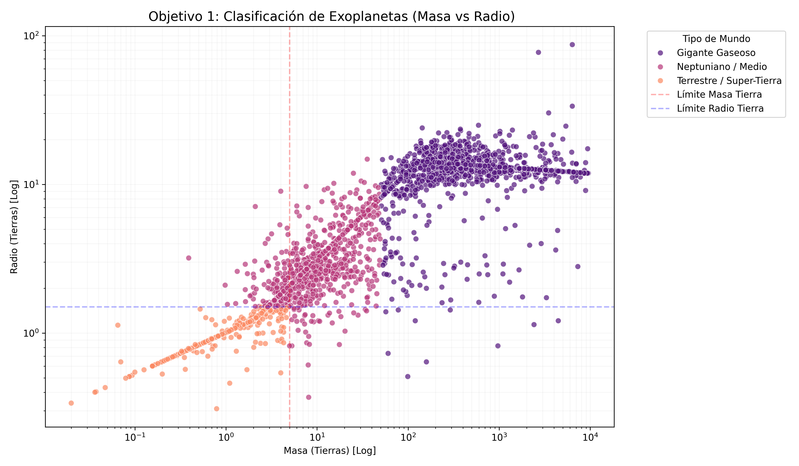
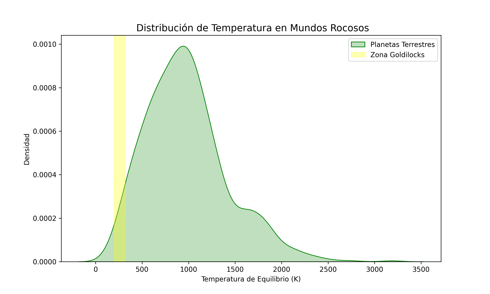
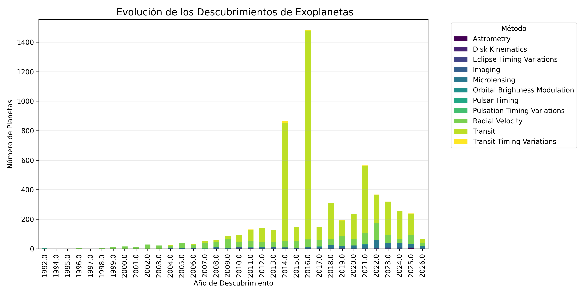
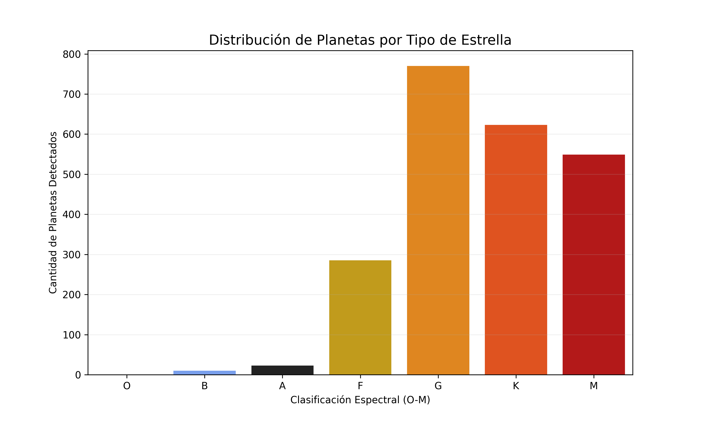
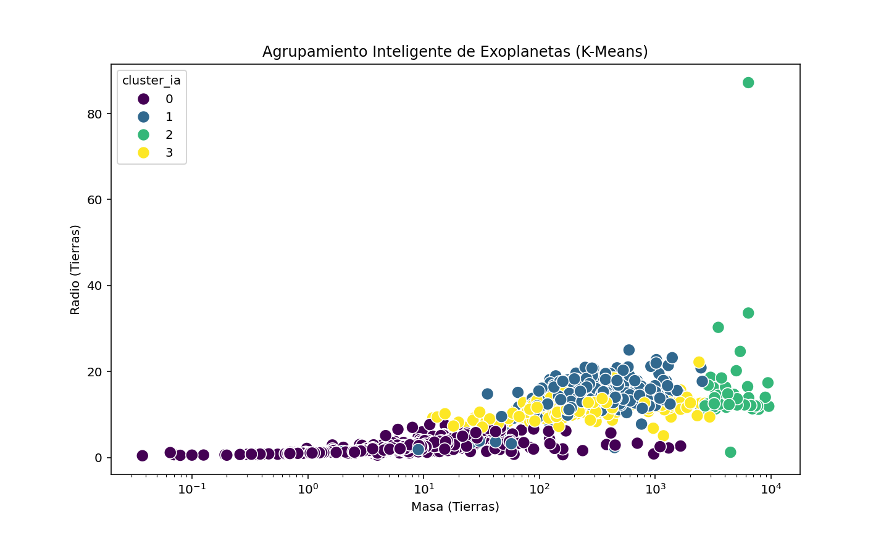

#  Exoplanet Explorer: Análisis de Habitabilidad y Machine Learning

[](https://www.python.org/downloads/)
[](https://opensource.org/licenses/MIT)
[](https://exoplanetarchive.ipac.caltech.edu/)

Este proyecto realiza un análisis integral de la base de datos de exoplanetas de la **NASA**, aplicando técnicas de limpieza de datos, análisis estadístico avanzado y **Machine Learning (K-Means Clustering)** para identificar candidatos habitables y clasificar mundos distantes de forma autónoma.

##  Características Principales

* **Pipeline de Datos Completo:** Proceso automatizado desde la ingesta de datos brutos hasta la generación de reportes ejecutivos en formato Word.
* **Análisis de Habitabilidad:** Algoritmos de filtrado basados en composición rocosa y la **Zona de Goldilocks** (rango térmico para agua líquida).
* **Machine Learning (IA):** Implementación de un modelo **K-Means Clustering** para agrupar planetas basándose en densidad, masa y radio, validando las categorías taxonómicas de forma no supervisada.
* **Visualización Científica:** Gráficas de alta fidelidad utilizando escalas logarítmicas, mapas de densidad (KDE) y scatter plots multidimensionales.
* **Reporte Automatizado:** Exportación dinámica de resultados, incluyendo tablas de "Candidatos VIP" y conclusiones del modelo de IA.

##  Stack Tecnológico

* **Lenguaje:** Python 3.x
* **Data Science:** `Pandas`, `NumPy`, `Scikit-Learn`
* **Visualización:** `Matplotlib`, `Seaborn`
* **Reportes:** `python-docx`

##  Visualización de Resultados
# Clasificación de Tipos de Mundos


Distribución logarítmica de Masa vs Radio.


## Análisis de la Zona de Goldilocks



Densidad de temperatura en planetas rocosos.

## Distancia y Tiempo


Número de  planetas, respecto al año de descubrimiento .

## ¿Qué tipo de estrellas tienen más planetas?



Cantidad de planetas detectados respecto a la clasificación espectral (O-M)

## Análisis de Inteligencia Artificial (ML)




La Inteligencia Artificial validó nuestra metodología: los grupos que definimos manualmente (Terrestres, Neptunianos y Gigantes) existen estadísticamente. El K-Means "aprendió" la estructura física de la galaxia sin que nadie le explicara qué es un planeta.

El modelo de **K-Means** identificó naturalmente 4 clusters de planetas, separando con precisión a los Gigantes Gaseosos de los mundos Terrestres, lo que valida nuestra metodología de clasificación manual:

> **Insight:** El algoritmo detectó patrones de masa y radio que coinciden con la distribución física real de la galaxia, destacando los "Outliers" o planetas con características extremas.

##  Estructura del Proyecto

```bash
├── data/               # Datasets originales (NASA Exoplanet Archive)
├── modules/            # Módulos de lógica (analysis, visualization, export)
├── results/            # Gráficas generadas y reportes finales (.docx)
├── config/             # Configuración de constantes y rutas (settings.py)
├──

